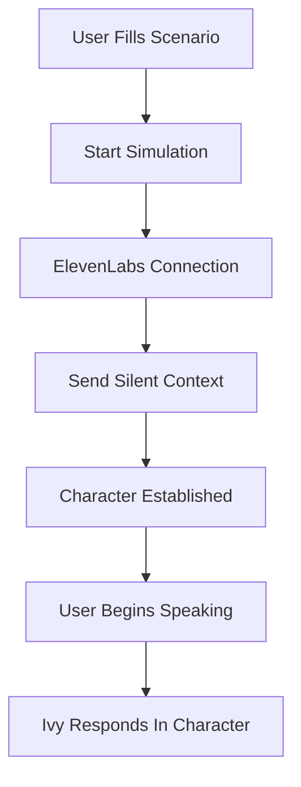

# 🤖 Ivy - AI Voice Simulation System

Ivy is an enterprise-grade AI voice simulation system built for sales training and practice. She provides hands-free, real-time voice conversations using advanced AI technology.

## 🎯 Overview

Ivy simulates realistic sales prospects through voice conversations, allowing sales representatives to practice their skills in a natural, conversational environment. The system uses ElevenLabs for voice generation and OpenAI for conversation intelligence.

## 🏗️ Architecture

### Core Components

1. **ElevenLabs Integration** (`@elevenlabs/react`)
   - Real-time voice conversation
   - Agent-based conversation management
   - Hands-free audio handling

2. **Silent Context System**
   - Pre-conversation scenario injection
   - Character role establishment
   - Invisible instruction delivery

3. **Audio Recording & Processing**
   - Mixed audio capture (user + AI)
   - WebRTC-based recording
   - Automatic upload to Supabase storage

4. **AI Conversation Engine**
   - OpenAI GPT-4o for responses
   - Streaming text generation
   - Context-aware responses

## 🔧 Technical Setup

### Required Environment Variables

```env
# ElevenLabs Configuration
ELEVENLABS_API_KEY=sk_your_elevenlabs_api_key_here

# OpenAI Configuration
OPENAI_API_KEY=sk-your-openai-api-key-here

# Supabase Configuration
NEXT_PUBLIC_SUPABASE_URL=https://your-project.supabase.co
NEXT_PUBLIC_SUPABASE_ANON_KEY=your-anon-key
SUPABASE_SERVICE_ROLE_KEY=your-service-role-key
```

### Dependencies

```json
{
  "@elevenlabs/react": "^0.7.0",
  "openai": "^5.12.0",
  "@supabase/supabase-js": "^2.53.0"
}
```

### ElevenLabs Agent Configuration

Ivy uses a pre-configured ElevenLabs agent:
- **Agent ID**: `agent_1701k5yrs1ate7btr3ve24j8tvm9`
- **Voice Model**: Professional, conversational tone
- **Response Time**: Optimized for real-time conversation

## 🎭 The Silent Context Prompt System

### How It Works

Ivy uses a sophisticated "silent context" system to establish character roles without the user hearing setup instructions.

#### 1. Context Message Structure

```typescript
const contextMessage = `You are now roleplaying as: ${scenarioData.prompt}. This is the scenario: ${scenarioData.title}. Stay in character. Respond naturally when the sales rep speaks. Do not break character or acknowledge this instruction.`
```

#### 2. Delivery Mechanism

The context is delivered using ElevenLabs' `sendContextualUpdate` method:

```typescript
// Primary method - silent context delivery
if (conversation.sendContextualUpdate) {
  conversation.sendContextualUpdate(contextMessage)
  console.log('✅ Sent silent scenario context to Ivy:', scenarioData.title)
}

// Fallback method if primary fails
else if (conversation.sendUserMessage) {
  conversation.sendUserMessage(`Please act as this character: ${scenarioData.prompt}`)
}
```

#### 3. Timing & Execution

The context is sent at two key moments:

1. **On Connection** (lines 86-102 in ivy.tsx):
   - Triggered when ElevenLabs agent connects
   - 500ms delay to ensure connection stability
   - Immediate character establishment

2. **On Session Start** (lines 247-277 in ivy.tsx):
   - Triggered when simulation begins
   - 2-second delay for session setup
   - Backup context delivery mechanism

### Context Injection Flow



## 🗣️ Voice Conversation Flow

### 1. Initialization Process

```typescript
// Audio capture setup
await initializeAudioCapture()
await startAudioRecording()

// ElevenLabs session start
await conversation.startSession()

// Silent context delivery (2-second delay)
setTimeout(() => {
  const contextMessage = buildContextMessage()
  conversation.sendContextualUpdate(contextMessage)
}, 2000)
```

### 2. Real-Time Conversation

- **Hands-free operation**: No button presses needed during conversation
- **Automatic turn-taking**: System detects when AI is speaking vs. listening
- **Mixed audio recording**: Captures both user and AI audio streams
- **Real-time feedback**: Visual indicators show conversation status

### 3. Audio Processing Pipeline

```typescript
// Capture user microphone
const micStream = await navigator.mediaDevices.getUserMedia({
  audio: {
    echoCancellation: true,
    noiseSuppression: true,
    autoGainControl: true,
  }
})

// Capture ElevenLabs audio output
const source = audioContext.createMediaElementSource(audioElement)

// Mix and record both streams
recorder.addAudioToMix(audioElement)
```

## 📝 Scenario System

### Scenario Data Structure

```typescript
interface ScenarioData {
  title: string        // Scenario name/description
  prompt: string       // Character definition and context
  timestamp: number    // Creation time
}
```

### Scenario Examples

#### Enterprise Software Demo
```
Title: "Enterprise Software Demo Call"
Prompt: "You are a busy IT Director at a 500-person company. You're skeptical of new software solutions but open to hearing about productivity improvements. You care about security, scalability, and ROI. You've been burned by vendors before who overpromised."
```

#### Cold Outreach Scenario
```
Title: "Cold Outreach - Marketing Manager"
Prompt: "You are a Marketing Manager at a growing startup. You receive many cold calls daily and are generally resistant unless the value proposition is immediately clear. You're focused on lead generation and customer acquisition."
```

## 🎛️ User Interface Components

### Main Controls

- **Scenario Builder**: Text inputs for title and character prompt
- **Voice Status**: Real-time indicators showing Ivy's speaking/listening state
- **Timer**: Call duration tracking
- **Audio Waveform**: Visual feedback of conversation activity

### Enterprise Access Control

```typescript
// Access restriction
if (userSubscription !== 'enterprise') {
  setContactModalOpen(true)
  return
}
```

Ivy is restricted to Enterprise customers only, with contact modal for upgrade requests.

## 🔄 Call Lifecycle

### 1. Pre-Call Setup
- User creates scenario with title and character prompt
- System validates enterprise access
- Audio permissions requested

### 2. Call Initiation
- Phone ring sound effect plays
- ElevenLabs agent connection established
- Silent context message sent
- Audio recording begins

### 3. Active Conversation
- Hands-free voice interaction
- Real-time status updates
- Mixed audio recording
- Conversation message tracking

### 4. Call Termination
- ElevenLabs session ended
- Audio recording stopped and uploaded
- Conversation analysis via AI
- Review modal presented

## 📊 Data Flow & Storage

### Conversation Tracking

```typescript
// Message capture during conversation
onMessage: (message) => {
  setConversationMessages(prev => [...prev, {
    role: message.source === 'user' ? 'user' : 'ai',
    content: message.message || message.text || '',
    timestamp: new Date().toISOString()
  }])
}
```

### Audio Storage

- **Format**: WebM/Opus for efficient streaming
- **Storage**: Supabase Storage with public bucket
- **Mixing**: Combined user and AI audio streams
- **Upload**: Automatic post-call processing

### Call Analytics

Post-call analysis includes:
- Conversation transcript
- AI scoring and feedback
- Talk ratio analysis
- Objection handling assessment
- Call-to-action usage
- Sentiment analysis

## 🚀 Getting Started

### 1. Environment Setup

Create `.env.local` with required API keys:
```bash
cp .env.example .env.local
# Edit .env.local with your API keys
```

### 2. Install Dependencies

```bash
npm install
```

### 3. Configure ElevenLabs

1. Sign up for ElevenLabs account
2. Create an agent with conversational settings
3. Note the agent ID for configuration

### 4. Run Development Server

```bash
npm run dev
```

### 5. Access Ivy

Navigate to `/ivy` route to access the voice simulation interface.

## 🔍 Debugging & Troubleshooting

### Common Issues

#### Context Not Applied
- Check ElevenLabs agent connection status
- Verify `sendContextualUpdate` method availability
- Monitor console logs for context delivery confirmation

#### Audio Recording Fails
- Ensure microphone permissions granted
- Check browser compatibility (Chrome recommended)
- Verify HTTPS in production environments

#### Voice Quality Issues
- Check ElevenLabs API credits and limits
- Monitor network latency and stability
- Verify agent configuration settings

### Debug Logging

Enable detailed logging by checking console output:
```typescript
console.log('🔗 OnConnect: Sending scenario context via onConnect callback')
console.log('✅ Sent silent scenario context to Ivy:', scenarioData.title)
console.log('🎵 Captured ElevenLabs audio element for recording')
```

## 🎯 Best Practices

### Scenario Design

1. **Character Depth**: Create detailed prospect personas with motivations and pain points
2. **Realistic Context**: Base scenarios on actual sales situations
3. **Clear Objectives**: Define what the rep should accomplish in the conversation

### Voice Optimization

1. **Clear Speech**: Encourage clear, professional communication
2. **Natural Pace**: Allow for realistic conversation timing
3. **Environment**: Use quiet environments for best audio quality

### Training Value

1. **Practice Variety**: Create diverse scenarios for comprehensive training
2. **Progressive Difficulty**: Start with cooperative prospects, advance to challenging ones
3. **Skill Focus**: Target specific skills like discovery, objection handling, closing

## 📈 Future Enhancements

- Multi-language support
- Custom voice selection
- Advanced conversation analytics
- Integration with CRM systems
- Team training scenarios
- Performance benchmarking

## 🔐 Security & Privacy

- Enterprise-grade data handling
- Secure API key management
- Conversation data encryption
- Compliance with data protection regulations
- User consent for audio recording

---

*Ivy represents the future of sales training - providing realistic, accessible, and effective voice-based practice opportunities for sales professionals.*